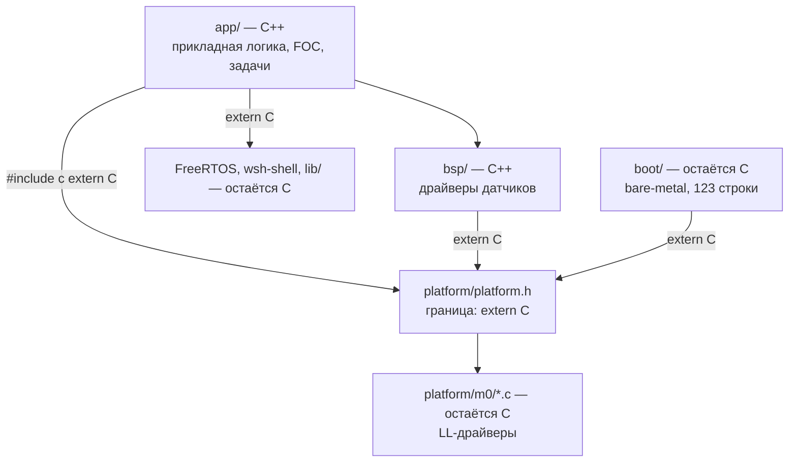

# Внедрение C++ в robot-ace

Аналитическая записка: как индустрия применяет C++ на микроконтроллерах, что это даёт
и чего стоит, и как это ложится конкретно на `robot-ace` (STM32G431CBU, FreeRTOS, FOC-контроллер PMSM).

Документ — **фаза сбора информации**. Конкретный пошаговый план миграции — отдельно, после
принятия решений из раздела [[#9. Что нужно решить до начала]].

---

## 0. Краткий вердикт

**C++ этому проекту подходит, и момент выбран правильный — до того, как написан FOC.**

Три причины именно для `robot-ace`:

1. **Основной алгоритм ещё не написан.** Мигрировать 4000 строк инфраструктуры дешевле, чем
   мигрировать её же вместе с отлаженным FOC. Позже цена вырастет в разы, а риск сломать
   работающее управление силовым мостом — недопустим.
2. **В коде уже есть ручной C++.** [encoder_m.h](../../bsp/encoder_m/encoder_m.h) — это
   написанная руками таблица виртуальных функций: 12 typedef'ов на указатели, struct-vtable
   и ~100 строк однотипных обёрток. Компилятор делает ровно то же самое бесплатно и без
   возможности забыть заполнить поле.
3. **Планируемые PID/Filter спроектированы через указатель на функцию** (`.calc = PID_Calc`
   из AGENTS.md). В ISR на 10 кГц это косвенный вызов, который нельзя заинлайнить.
   Шаблон C++ превращает его в прямой инлайн — это выигрыш в самом горячем месте прошивки.

**Но с жёсткими ограничениями:** без исключений, без RTTI, без кучи, без STL-контейнеров,
без нетривиальных глобальных конструкторов. Это не «C++ как на десктопе» — это
«C с классами, шаблонами и constexpr». Подробности — [[#5. Подмножество: что брать, а что не брать]].

**Чего делать не нужно:** переписывать `boot/`, `lib/ring_buff`, `platform/m0/c0/*` и
трогать FreeRTOS/wsh-shell. Обоснование — [[#7. Карта проекта: где C++ выигрывает, а где нет]].

---

## 1. Исходное состояние проекта (замеры)

Всё ниже — фактические цифры, снятые с текущего `dev` (коммит `d56f2e3`).

**Бюджет ресурсов:**

| Ресурс | Занято | Доступно | % |
|---|---|---|---|
| Flash (app) | 60 200 B (`.text`) + 784 B (`.data`) | 98 304 B (96 KB, `FLASH_APP_SIZE`) | **62 %** |
| RAM | 784 B (`.data`) + 12 060 B (`.bss`) | 32 256 B (`0x7e00`) | **40 %** |
| В т.ч. куча FreeRTOS | 8 192 B (`configTOTAL_HEAP_SIZE`, heap_4) | — | 25 % всей RAM |

Свободно: **~37 KB Flash** и **~19 KB RAM**. Это довольно комфортный запас — но FOC, CAN,
токовые датчики и логирование его съедят. Бюджет на «накладные расходы языка» стоит
считать в единицах килобайт, а не десятков.

**Объём собственного кода:**

| Слой | Строк (.c) | Комментарий |
|---|---|---|
| `app/` | 2296 | debug (420), shell (373), watchdog, health_check |
| `lib/` | 1609 | ring_buff (667), shared_mutex (299), ring_list (265), rand (74) |
| `platform/m0/` | ~1330 | LL-драйверы: i2c, sys, dma, gpio, usart, tim, int |
| `bsp/` | 536 | encoder_m + AS5600 |
| `shared/` | 388 | типы, макросы, delay, syscalls |
| `boot/` | 123 | bare-metal загрузчик |

Итого ~3942 строки `.c` — **это очень маленький проект**. Миграция реальна.

**Инструменты (проверено):**

- `arm-none-eabi-gcc/g++` **15.2.1** (Arm GNU Toolchain 15.2.Rel1) — полный C++23,
  частично C++26. Это свежий тулчейн, никаких ограничений по языку нет.
- CMake 4.3.2, Ninja 1.13.2.
- `CMAKE_CXX_COMPILER` в [CMakeLists.txt:6](../../CMakeLists.txt#L6) **уже прописан**,
  но `enable_language(CXX)` не вызывается.

---

## 2. Как индустрия применяет C++ на МК в 2026

### 2.1 Расстановка сил

Картина по отраслям устойчива уже несколько лет:

- **Автомобилестроение** — C++ де-факто стандарт для всего выше уровня драйверов.
  AUTOSAR Adaptive Platform целиком на C++14/17. Классический AUTOSAR — C, но прикладной
  слой всё чаще C++. По отчёту Perforce *2026 State of Automotive Software*, MISRA
  используют **61 %** опрошенных (рост на 8 % за год).
- **Медтехника, авиация, промышленная автоматика** — C++ с сертифицируемым подмножеством.
- **Дроны / робототехника** — смешанно. PX4 — C++. ArduPilot — C++. Betaflight — C.
  **VESC (ваш референс) — чистый C.** Это важный контрпример: лучший в классе открытый
  FOC-контроллер написан на C и прекрасно живёт.
- **Массовый низовой embedded (8/16-бит, дешёвые Cortex-M0)** — по-прежнему C.
  C остаётся ведущим языком embedded по доле рынка.
- **Хобби/DIY FOC** — SimpleFOC на C++ (через Arduino), и это один из самых
  успешных проектов в нише.

**Вывод:** на Cortex-M4F с 128 KB Flash C++ — совершенно мейнстримный выбор в 2026.
Спорным он был лет 15 назад. Но и C здесь не «устаревший» — VESC это доказывает.

### 2.2 Нормативные стандарты

| Стандарт | Статус | Суть |
|---|---|---|
| **MISRA C++:2023** | Актуальный, вышел окт. 2023 | 179 правил, таргет **C++17**. Слил в себя MISRA C++:2008 и AUTOSAR C++14. То, что сейчас ожидают аудиторы TÜV для Cortex-M/R. |
| AUTOSAR C++14 | Заморожен | Поглощён MISRA C++:2023. Новые проекты на него не начинают. |
| MISRA C:2012 (+ Amd) | Актуален для C | Если остаётесь на C. |
| JSF++ | Legacy | Авиация, исторический. |
| CERT C++ | Дополняющий | Безопасность, не функциональная безопасность. |

Поддержка в анализаторах догоняет: у Sonar в первом релизе покрыто 84 из 179 правил
MISRA C++:2023, у Perforce/Parasoft покрытие полнее. Полностью автоматической проверки
пока нет ни у кого.

**Для `robot-ace` это пока не обязательно** — сертификации нет. Но MISRA C++:2023 полезно
читать как готовый список граблей: он по сути и есть выжимка «какое подмножество C++
безопасно на МК».

### 2.3 Экосистема библиотек

Здесь ключевой момент: **обычный STL на МК не используют**. Используют заменители.

| Библиотека | Что даёт | Стоит ли смотреть |
|---|---|---|
| **ETL** (Embedded Template Library) | Контейнеры фиксированной ёмкости: `etl::vector<T,N>`, `etl::string<N>`, `etl::map`, `etl::circular_buffer`, конечные автоматы, пулы. Ноль динамической памяти, RTTI не нужен, обработка ошибок настраивается (исключения / assert / лог / отключить). Header-only. | **Да.** Самая широкая продакшн-база из всех альтернатив. |
| EASTL | Аналог от EA, ориентирован на игры | Скорее нет — тяжелее ETL |
| modm | Генератор HAL + C++ библиотека | Нет — конфликтует с вашим `platform/` слоем |
| **Часть STL — можно** | `<type_traits>`, `<utility>`, `<algorithm>` (не-аллоцирующие), `<array>`, `<bit>`, `<span>`, `<optional>`, `<limits>`, `<concepts>` | **Да**, это header-only и почти всегда бесплатно |
| **Часть STL — нельзя** | `<iostream>`, `std::string`, `std::vector`, `std::map`, `std::function`, `<regex>` | Нет — куча и/или килобайты кода |

Отдельно: **C++26 добавляет `std::inplace_vector`** (P0843) — вектор фиксированной ёмкости
со storage на стеке, ровно то, что embedded-сообщество просило годами. Прямая замена
`etl::vector`. В C++26 он пока помечен как *не freestanding* — этот вопрос вынесен в
отдельную работу. Появится в GCC — можно будет отказаться от части ETL.

Также идёт большая работа по **freestanding C++** (P1642 и серия) — формализация того,
какая часть стандартной библиотеки гарантированно доступна без ОС и без кучи. Это ровно
ваш сценарий, и с каждым стандартом ситуация улучшается.

### 2.4 Практика миграции C → C++

Индустриальный консенсус, подтверждаемый и практиками (Beningo, Embedded Artistry,
Embedded.com), и опытом больших кодовых баз:

- **Не переписывать всё сразу.** Низкоуровневый железозависимый код оставляют на C,
  C++ вводят сверху, в прикладной логике.
- **Новые модули пишутся на C++, старые линкуются как есть.** Заголовки C оборачиваются
  в `extern "C"`. За 6–12 месяцев основная активная часть кодовой базы естественно
  переезжает, без единого рискованного «большого взрыва».
- **Порядок освоения:** сначала C++ как «улучшенный C» (namespace, `constexpr`, ссылки,
  `enum class`, строгая типизация), потом композиция и классы, и только потом шаблоны
  и статический полиморфизм там, где они реально нужны.
- Оценка накладных расходов при дисциплинированном подмножестве — **0–5 %** по размеру
  кода; RAII и шаблоны при включённом инлайнинге дают ассемблер, идентичный C.

---

## 3. Плюсы — привязка к вашему коду

Абстрактные достоинства C++ описаны везде. Ниже — только то, что реально попадает
в `robot-ace`.

### 3.1 Виртуальные функции вместо ручных vtable

`bsp/encoder_m/` сейчас — это 12 typedef'ов указателей на функции, две struct-таблицы
(`EncoderM_Interface_t`, `EncoderM_t`), и ~100 строк обёрток вида:

```c
u16 EncoderM_GetRawAngle(void) {
    if (!EncoderM_IsAttached) { PANIC(); return 0; }
    return EncoderM_Ptr->GetRawAngle();
}
```

Это ручная реализация полиморфизма. Проблемы: поле в таблице можно забыть заполнить
(получите вызов по `NULL`), проверка `IsAttached` дублируется в каждой функции,
нет никакой проверки на этапе компиляции, что драйвер реализовал весь интерфейс.

В C++ это абстрактный класс: компилятор сам строит vtable, а `override` не даст
опечататься в сигнатуре. **Замерено: стоимость идентичная** (см. [[#4.1 Реальные замеры на вашем тулчейне]]).

### 3.2 Шаблоны вместо указателя на функцию в горячем ISR

Планируемый дизайн PID (из AGENTS.md) — struct с полем `.calc = PID_Calc`. В ISR на 10 кГц:

```
косвенный вызов → загрузка адреса из RAM → branch → нет инлайна → нет
константного распространения коэффициентов
```

Шаблонный/CRTP-вариант даёт прямой вызов, который GCC заинлайнит, а `constexpr`-коэффициенты
превратит в непосредственные операнды. На Cortex-M4F в цикле 10 кГц это заметная разница.

### 3.3 constexpr — таблицы синусов в Flash, не в RAM

Для FOC нужны таблицы sin/cos. В C есть два пути: сгенерировать таблицу скриптом и
вставить литералы (некрасиво, легко рассинхронизировать с параметрами), или посчитать
в рантайме при старте — это **512+ байт RAM** плюс код инициализации.

В C++ таблица считается компилятором и ложится в `.rodata`. **Замерено:**
`constexpr std::array<u16,256>` с рантайм-индексом → **512 B во Flash, 0 B RAM,
0 инструкций инициализации**, при этом формула остаётся в исходнике читаемой.

### 3.4 Строгие типы — защита от классической ошибки FOC

Самый частый и самый дорогой класс багов в FOC — перепутать электрический угол
с механическим, или ток в амперах с током в отсчётах АЦП. В C это всё `float`, компилятор
молчит, а мотор идёт вразнос.

Zero-cost обёртки (`struct ElecAngle { float v; }` с operator'ами) делают такую ошибку
ошибкой компиляции. Ассемблер при этом байт в байт тот же. Для проекта, который управляет
силовым мостом, это не косметика.

### 3.5 RAII для критических секций

Сейчас: `SYS_CRITICAL_ON()` / `SYS_CRITICAL_OFF()`. Забытый `OFF` на пути раннего возврата
(а у вас есть `RETURN_IF_UNSUCCESS`, который возвращается из середины функции) — это
намертво запрещённые прерывания. RAII-guard закрывает секцию автоматически на любом
пути выхода. Стоимость — нулевая.

Тот же приём для мьютексов FreeRTOS (`lib/shared_mutex`).

### 3.6 Устранение бойлерплейта задач FreeRTOS

Паттерн из AGENTS.md (static handle → task fn → create-guard → init wrapper) повторяется
в каждом модуле дословно. CRTP-база `Task<Derived, StackWords, Prio>` убирает повторение
и делает невозможным забыть guard от двойного создания.

### 3.7 Прочее по мелочи

- `enum class` вместо `RET_STATE_t` — нельзя случайно сравнить с `int` или с другим enum.
- `namespace` вместо префиксов `EncoderM_`, `Pl_`, `RingBuff_`.
- Ссылки вместо указателей там, где `NULL` невозможен — уходят проверки.
- `static_assert` на размеры буферов, стеков задач, соответствие таблиц и enum'ов.
- `[[nodiscard]]` на функциях, возвращающих `RET_STATE_t` — компилятор не даст
  проигнорировать код ошибки. Для вашего стиля обработки ошибок это прямо в точку.

---

## 4. Минусы и риски — с цифрами

### 4.1 Реальные замеры на вашем тулчейне

Собрано `arm-none-eabi-g++ 15.2.1`, `-mcpu=cortex-m4 -mfpu=fpv4-sp-d16 -mfloat-abi=hard`,
`-O1`, `-specs=nano.specs`, `-Wl,--gc-sections`. Минимальные программы, поэтому цифры
показывают **фиксированную цену механизма**, а не долю в реальной прошивке.

| Сценарий | `.text` | `.data` | `.bss` |
|---|---|---|---|
| C: struct с указателем на функцию | 20 | 0 | 4 |
| **C++: `virtual`, `-fno-exceptions -fno-rtti`** | **40** | **4** | **4** |
| C++: то же, но **исключения ВКЛючены** | **4 316** | 84 | 8 |
| `std::function`, исключения выкл | 360 | 88 | 24 |
| `std::function`, исключения вкл | **7 596** | 96 | 44 |
| `constexpr std::array<u16,256>`, рантайм-индекс | 28 + **512 `.rodata`** | 0 | 4 |

**Как это читать:**

- Виртуальный вызов против ручной таблицы указателей — разница ~20 байт на класс
  (сама vtable). По сути **бесплатно**. При `-flto` и `final` GCC часто девиртуализует
  вызов полностью.
- **Исключения — главная статья расходов: +4.3 KB минимум**, только за то, что механизм
  включён. Это ~12 % вашего свободного Flash. И это ещё не главная проблема (см. 4.2).
- `std::function` даже без исключений — 360 B кода и 88 B данных на одну переменную.
  Наглядно, почему в embedded используют `etl::delegate` или обычный указатель на функцию.

### 4.2 Исключения: проблема не в размере, а во времени

Даже если 4.3 KB не жалко — **время раскрутки стека не ограничено сверху** и зависит от
глубины вызовов и таблиц раскрутки. В контексте `robot-ace` это означает:

> Исключение, брошенное в ADC ISR на 10 кГц, может сорвать дедлайн управления мостом.

Для железа, которое коммутирует силовые транзисторы, недетерминированная задержка в
контуре управления — это потенциально сквозной ток и выгоревшая плата. **`-fno-exceptions`
здесь не «оптимизация», а требование безопасности.**

### 4.3 Статическая инициализация — самая опасная ловушка

Конструкторы глобальных объектов выполняются в `__libc_init_array` — **до `main()`**,
то есть **до `Pl_Init()`, до настройки тактирования, до инициализации периферии**.

Порядок вызова конструкторов между разными единицами трансляции стандартом **не определён**.

Что это значит на практике: глобальный объект, конструктор которого трогает регистр
периферии, отработает на неинициализированных тактах. На моторном контроллере это класс
багов, который проявляется «иногда, после перекомпиляции».

**Правило: никаких нетривиальных глобальных конструкторов.** Только `constinit`
(инициализация на этапе компиляции, объект уходит в `.data`/`.rodata`) плюс явный
метод `init()`, вызываемый из `main()` в контролируемом порядке — ровно как сейчас
устроен ваш `main.c`.

Отдельно: **функционально-локальные `static`** (`Meyers singleton`) генерируют guard-переменную
и вызовы `__cxa_guard_acquire/release`. Обязательно `-fno-threadsafe-statics`.

### 4.4 Скрытая динамическая память

`new` по умолчанию тянет `malloc`. В проекте есть куча FreeRTOS (heap_4, 8 KB), но
`operator new` пойдёт мимо неё — в newlib'овский `malloc`, который в вашей конфигурации
(`-specs=nosys.specs`, `syscalls.c`) ведёт себя непредсказуемо и не потокобезопасен
относительно FreeRTOS.

Плюс скрытые аллокации в STL: `std::string`, `std::vector`, `std::function` (при большом
захвате) аллоцируют молча.

**Решение:** определить свои `operator new`/`delete`, которые вызывают `PANIC()`.
Тогда любая случайная аллокация — не тихая деградация, а немедленный отказ на стенде.

> Побочно: в [debug.c](../../app/features/debug/debug.c) `DebugMsg_t` уже использует
> heap-выделенный `char* Ptr` для очереди сообщений. Это существующая, не связанная с C++
> точка, где стоит подумать про пул фиксированного размера.

### 4.5 Прочие издержки

- **Время компиляции** растёт из-за шаблонов. При 4000 строках — не проблема.
- **Раздувание кода шаблонами.** `RingBuffer<u8,256>` и `RingBuffer<u16,128>` — это два
  независимых набора кода. Лечится вынесением не зависящей от типа логики в базовый
  не-шаблонный класс.
- **Читаемость дизассемблера и map-файла** ухудшается из-за манглинга имён.
  `arm-none-eabi-nm -C` / `c++filt` решают. Ваш `scripts/memory_table.py` парсит только
  размеры регионов памяти, а не символы — **он не сломается**.
- **Порог входа в команде.** Плохо написанный C++ хуже хорошо написанного C. Нужен
  жёсткий, записанный стайлгайд — иначе через год в проекте будут и шаблонная магия,
  и `std::shared_ptr`.
- **Смешение C и C++ в одном проекте** требует дисциплины с `extern "C"` (см. 6.3),
  иначе получаются ошибки линковки, которые новичка ставят в тупик.

---

## 5. Подмножество: что брать, а что не брать

Это ядро всего документа. Рекомендуемый профиль для `robot-ace`:

### Брать безусловно (стоимость ~ноль)

| Возможность | Зачем здесь |
|---|---|
| `constexpr` / `consteval` | Таблицы sin/cos во Flash, расчёт делителей таймеров, dead-time |
| `enum class` | Замена `RET_STATE_t`, `ENCODER_M_t`, состояний мотора |
| `namespace` | Замена префиксов `Pl_`, `EncoderM_` |
| Ссылки | Там, где `NULL` невозможен |
| Перегрузка функций | `Read(u8&)`, `Read(u16&)` |
| Аргументы по умолчанию | Мелочь, но убирает дублирование |
| `static_assert` | Проверка размеров буферов и стеков на этапе компиляции |
| `[[nodiscard]]`, `[[maybe_unused]]` | Замена `DISCARD_UNUSED`, контроль кодов возврата |
| RAII (guard-объекты) | Критические секции, мьютексы |
| `std::array` | Замена сырых массивов, знает свой размер |
| `<type_traits>`, `<concepts>`, `<bit>`, `<limits>`, `<span>` | Header-only, кода не добавляют |
| Строгие типы-обёртки | `ElecAngle`, `Ampere`, `Volt` — защита от главного бага FOC |
| Шаблоны с ограниченным набором инстанцирований | PID, фильтры, кольцевой буфер |

### Брать осторожно

| Возможность | Условие |
|---|---|
| `virtual` | Только там, где полиморфизм действительно нужен в рантайме (драйверы датчиков). **Не в ISR-пути.** Всегда `final`, где возможно |
| Наследование | Только публичное, только для интерфейсов. Никакого множественного |
| CRTP / статический полиморфизм | Для горячих путей вместо `virtual` |
| Лямбды | Только non-capturing или с малым захватом, **без** `std::function` |
| `std::optional` | Полезно, но следить за размером |
| `std::expected` (C++23) | Просится как замена `RET_STATE_t`, но замерить размер перед внедрением |
| ETL | Хорошая библиотека, но это ещё одна зависимость. Заводить, когда появится реальная потребность |

### Не брать никогда

| Что | Почему |
|---|---|
| **Исключения** (`-fno-exceptions`) | +4.3 KB и неограниченная задержка в ISR |
| **RTTI** (`-fno-rtti`) | `dynamic_cast`/`typeid` не нужны, таблицы типов занимают Flash |
| **Куча** (`new`/`delete`) | Фрагментация, недетерминированность. Перехватить в `PANIC()` |
| `std::string`, `std::vector`, `std::map`, `std::function` | Куча + размер |
| `<iostream>` | Десятки килобайт |
| `std::shared_ptr` | Атомарный счётчик + куча |
| Нетривиальные глобальные конструкторы | Static init order fiasco до настройки тактов |
| Множественное/виртуальное наследование | Сложные vtable, непрозрачная стоимость |
| Функционально-локальные `static` без `-fno-threadsafe-statics` | Guard-переменные, не-реентерабельны |

---

## 6. Механика внедрения

### 6.1 Что в проекте уже готово

Приятная новость: **инфраструктура для C++ уже на месте**, её не писали специально, но она есть.

- [startup.s:99](../../platform/m0/startup.s#L99) — `bl __libc_init_array` **уже вызывается**.
  Это то, что запускает конструкторы глобальных объектов.
- [linker_script.ld](../../platform/m0/linker_script.ld#L105-L130) — секции
  `.preinit_array`, `.init_array`, `.fini_array` **уже описаны** с `KEEP(...)`.
- [CMakeLists.txt:6](../../CMakeLists.txt#L6) — `CMAKE_CXX_COMPILER` **уже задан**.
- [def_types.h](../../shared/def_types.h) и [ring_buff.h](../../lib/ring_buff/ring_buff.h)
  **уже обёрнуты** в `#ifdef __cplusplus / extern "C"`.
- [.clang-format](../../.clang-format) — `Language: Cpp`, то есть форматирование
  C++-файлов заработает сразу.

То есть значительная часть «подготовительной» работы, которая обычно и отпугивает,
в проекте уже сделана.

**Чего не хватает:** `enable_language(CXX)`, набора флагов C++, `extern "C"` в остальных
заголовках, и перехвата `operator new`.

### 6.2 Флаги компиляции

Рабочий набор для этого профиля:

```cmake
-std=c++23                  # GCC 15.2 поддерживает полностью
-fno-exceptions             # см. 4.2 — требование безопасности
-fno-rtti                   # таблицы типов не нужны
-fno-threadsafe-statics     # убирает __cxa_guard_acquire
-fno-use-cxa-atexit         # регистрация деструкторов через .fini_array, а не в рантайме (см. ниже)
-fno-unwind-tables          # убирает .ARM.exidx
-fno-asynchronous-unwind-tables
-Wold-style-cast            # ловит C-style касты при переносе кода
-Woverloaded-virtual
-Wsuggest-override
```

Плюс к линкеру — `-Wl,--gc-sections` уже есть.

Полезная проверка после первой сборки: убедиться, что в map-файле нет
`__cxa_throw`, `__gxx_personality_v0`, `_Unwind_*`, `malloc`. Если есть — что-то
протащило исключения или кучу.

**Про `-fno-use-cxa-atexit` — уточнение.** Флаг не убирает деструкторы глобальных
объектов, он меняет способ их регистрации (замерено на GCC 15.2):

| | `-fuse-cxa-atexit` (умолчание) | `-fno-use-cxa-atexit` |
|---|---|---|
| Регистрация | в рантайме: `__aeabi_atexit(dtor, &obj, &__dso_handle)` при конструировании | на этапе линковки: запись в `.fini_array` |
| Требует | `__dso_handle` — в bare-metal отсутствует, ошибка линковки | ничего |
| Стоимость | код регистрации + запись в atexit-таблице **в RAM** | 4 байта во Flash |
| Когда вызовется | только `exit()` / возврат из `main()` | только `exit()` / возврат из `main()` |

То есть флаг экономит RAM и снимает зависимость от `__dso_handle`. Вызываться
деструкторы не будут в любом случае — прошивка из `main()` не выходит.

**Важно: это касается и перехода app → boot.** [`Pl_JumpToAddr()`](../../platform/m0/platform.c#L77)
меняет `VTOR`, `MSP` и уходит на reset-вектор другой прошивки. Это не возврат из `main()`
и не `exit()`, поэтому деструкторы не отработают ни при каких флагах.

Полагаться на деструкторы для приведения железа в безопасное состояние нельзя и
принципиально: порядок вызова деструкторов между единицами трансляции обратен порядку
конструкторов, который стандартом не определён.

Что действительно нужно перед переходом app → boot:

| Шаг | Почему критично |
|---|---|
| **PWM в High-Z** (`stop_pwm_hw()`, см. [[recommendations]]) | Загрузчик не знает про TIM1 и мост не выключит — ключи продолжат коммутировать во время startup новой прошивки |
| Остановить DMA | DMA продолжит писать по адресам старой раскладки RAM в момент обнуления `.bss` |
| NVIC: disable + clear pending | Зависшее pending-прерывание выстрелит уже в новую векторную таблицу |
| Остановить SysTick | Тик FreeRTOS продолжит стрелять |
| FreeRTOS | Планировщик корректно остановить нельзя в принципе |

**Рекомендуемая схема — не прыжок, а сброс:**

```c
BkpStorage_SetRegister(BKP_REG_BOOT_REQUEST, MAGIC_STAY_IN_BOOT);
Pl_SoftReset();   // → Sys_MCU_Reset()
```

Аппаратный сброс приводит всю периферию в reset-состояние гарантированно — забыть
ничего нельзя. Загрузчик читает флаг из backup-регистра RTC (переживает сброс) и решает,
оставаться в себе или прыгать в app.

Асимметрия: **boot → app прыжком безопасно** (периферия ещё в reset-состоянии),
**app → boot прыжком — нет** (app успел поднять мост, DMA, таймеры и RTOS).

> Отдельно, не связано с C++: в [platform/m0/CMakeLists.txt:2-5](../../platform/m0/CMakeLists.txt#L2-L5)
> `FLASH_APP_ADDR` == `FLASH_BOOT_ADDR` == `0x08000000` — app и boot линкуются по одному
> адресу и перекрываются. Сейчас безвредно, т.к. `boot/main.c` — заглушка с
> закомментированным прыжком. При появлении реального загрузчика app нужно сдвинуть
> на `0x08004000`.

### 6.3 Граница C и C++

Правило простое и одностороннее:



- Каждый заголовок C, который включается из C++, оборачивается в
  `#ifdef __cplusplus extern "C" { #endif`. У вас так уже сделано в двух файлах —
  нужно распространить на `platform.h`, `def_sys.h`, `def_rtos.h`, `bsp.h` и остальные.
- Функции C++, вызываемые из C (обработчики прерываний, `main`, коллбэки, передаваемые
  в FreeRTOS или в LL-драйверы), объявляются `extern "C"` — иначе манглинг имени
  не даст слинковаться.
- **Обработчики прерываний из `startup.s`** — критично: их имена в векторной таблице
  не манглятся. Любой ISR, переписанный на C++, обязан быть `extern "C"`.

### 6.4 Запрет кучи

```cpp
// новый файл, например app/cpp_runtime.cpp
void* operator new(std::size_t)            { PANIC(); return nullptr; }
void  operator delete(void*) noexcept       { PANIC(); }
void  operator delete(void*, std::size_t) noexcept { PANIC(); }
extern "C" void __cxa_pure_virtual()        { PANIC(); }
```

`__cxa_pure_virtual` вызывается при обращении к чисто виртуальной функции через
не до конца сконструированный объект — на МК это должно быть громким отказом, а не UB.

### 6.5 Порядок инициализации

Ваш текущий `main.c` уже построен правильно — явная последовательность
`Pl_Init()` → `Pl_SysCpuCnt_Init()` → ... → `vTaskStartScheduler()`. **Эту схему нужно сохранить.**

C++ не должен её подменять. Все объекты — `constinit` глобалы или члены классов
с явным `init()`, вызываемым из `main()`.

### 6.6 CMake

Минимальные изменения в корневом `CMakeLists.txt`:

```cmake
enable_language(C CXX ASM)   # было: enable_language(C ASM)
set(CMAKE_CXX_STANDARD 23)
set(CMAKE_CXX_STANDARD_REQUIRED ON)
set(CMAKE_CXX_EXTENSIONS OFF)
```

Флаги C++ добавляются через генераторное выражение, чтобы не задеть C-файлы:

```cmake
add_compile_options(
    $<$<COMPILE_LANGUAGE:CXX>:-fno-exceptions;-fno-rtti;-fno-threadsafe-statics;...>
)
```

`app/CMakeLists.txt` использует `file(GLOB_RECURSE ... "*.c")` — маску нужно расширить
до `*.cpp`, иначе новые файлы просто не попадут в сборку и это будет неочевидно.

### 6.7 FreeRTOS и C++

- Ядро остаётся на C, линкуется как есть.
- Функции задач передаются в `xTaskCreate` как `extern "C"` или как статические
  функции-трамплины — типовой приём: статический метод класса, который кастует
  `pvParameters` в `this` и вызывает нестатический метод.
- `configSUPPORT_STATIC_ALLOCATION` сейчас `0`, `configSUPPORT_DYNAMIC_ALLOCATION` `1`.
  При переходе на C++-обёртки задач стоит рассмотреть статическое размещение
  (`xTaskCreateStatic`) — стеки и TCB станут членами объектов в `.bss`, детерминированно
  и без кучи FreeRTOS.

---

## 7. Карта проекта: где C++ выигрывает, а где нет

### Явно выигрывает

| Модуль | Что даёт |
|---|---|
| **`bsp/encoder_m/`** | Прямая замена ручной vtable на абстрактный класс. Минус ~100 строк бойлерплейта, плюс проверки компилятора. **Лучший кандидат на пилот.** |
| **FOC-ядро (пишется с нуля)** | Строгие типы (`ElecAngle` vs `MechAngle`, `Ampere`), `constexpr` таблицы sin/cos, шаблонные PID/фильтры с инлайном в ISR |
| **PID / Filter (планируются)** | Шаблон вместо указателя на функцию — прямой инлайн в горячем цикле 10 кГц |
| **Задачи FreeRTOS** | CRTP-база убирает четырёхкратно повторённый паттерн |
| **Критические секции / мьютексы** | RAII-guard, невозможно забыть закрыть |
| **`app/features/*`** | Новый код пишется на C++, старый переезжает по мере правок |

### Выигрыш сомнительный — не трогать

| Модуль | Почему |
|---|---|
| **`platform/m0/c0/*.c`** | Работа с регистрами через LL. C++ здесь не добавляет ничего, кроме риска. Шаблонные обёртки над GPIO — популярное упражнение, но чистая трата времени в вашем случае |
| **`lib/ring_buff.c` (667 строк)** | Работает, отлажен, стабилен. Шаблонная версия была бы красивее, но переписывание работающего кода без функциональной причины — чистый риск |
| **`boot/` (123 строки)** | Bare-metal загрузчик. Меньше зависимостей = лучше. Оставить C |
| **`thirdparty/`** | FreeRTOS и wsh-shell — не трогать вообще |
| **`shared/def_macro.h`** | Часть макросов (`GET_MIN`, `CUT_MIN_MAX`) просится в `constexpr`-функции, но выигрыш косметический |

### Отдельно: скрытая находка

При просмотре `def_macro.h` заметен баг, не связанный с C++:

```c
#define REG_MODIFY(reg, CLEARMASK, SETMASK) \
    (BIT_SET((reg), (((BIT_READ(reg)) & (~(CLEARMASK))) | (SETMASK))))
```

`BIT_READ` определён как двухаргументный (`BIT_READ(reg, bit)`), а вызывается с одним.
Макрос, судя по всему, нигде не используется — иначе сборка бы падала. Стоит либо
починить, либо удалить. Это ровно тот класс проблем, который `constexpr`-функция
сделала бы невозможным.

---

## 8. Когда C++ на МК оправдан, а когда нет

Обобщая — критерии не про размер памяти, а про характер задачи.

### Стоит внедрять

- **Есть несколько реализаций одной абстракции.** Разные энкодеры, разные датчики тока,
  разные протоколы связи. Ровно ваш случай с `encoder_m`.
- **Много вычислений с физическими величинами.** FOC, регуляторы, фильтры — там,
  где перепутанные единицы измерения ломают железо.
- **Проект будет жить и расти годами**, кодовая база от нескольких тысяч строк.
- **Нужны compile-time вычисления** — таблицы, конфигурации, автоматы.
- **Ресурсов достаточно.** Cortex-M4 с 128 KB Flash — с запасом.
- **Нужны тесты на хосте** — не зависящий от железа код на шаблонах тестировать намного проще.

### Не стоит

- **Очень тесные ресурсы**: 8/16-бит МК, Cortex-M0 с 8–16 KB Flash. Накладные расходы
  становятся заметной долей.
- **Компилятор без нормального C++.** Некоторые вендорские тулчейны застряли на C++03
  или на «Embedded C++» (урезанный диалект без шаблонов). У вас GCC 15.2 — проблемы нет.
- **Проект — тонкая обёртка над вендорским HAL**, вся логика в железе, полиморфизма нет.
- **Код на 500 строк, который пишется один раз** и больше не трогается.
- **В команде никто не знает C++.** Плохой C++ на МК хуже хорошего C — и это не фигура
  речи, а типовой сценарий провала.
- **Требуется сертификация по стандарту, который C++ не покрывает**, или нанятый
  аудитор работает только с MISRA C.

### Промежуточный вариант, который часто выбирают

Оставить C, но взять из C11/C17 то, что закрывает часть проблем: `_Static_assert`,
`_Generic`, designated initializers (уже используются), `const`-корректность.
Это дешевле, но не даёт ни шаблонов, ни RAII, ни строгих типов — то есть не закрывает
три главных выигрыша из раздела 3.

---

## 9. Что нужно решить до начала

Список вопросов, ответы на которые определят пошаговый план:

1. **Целевой стандарт: C++20 или C++23?** GCC 15.2 тянет оба. C++23 даёт `std::expected`
   и более удобный `constexpr`. Аргумент за C++20 — MISRA C++:2023 нацелен на C++17,
   и чем ближе к нему, тем проще будет, если сертификация всё-таки появится.
2. **Насколько важна перспектива сертификации?** Если «может быть, когда-нибудь» —
   имеет смысл сразу писать в духе MISRA C++:2023, это почти не удорожает разработку.
   Если «нет» — можно свободнее пользоваться шаблонами.
3. **Границы миграции.** Предложение: `app/` + `bsp/` → C++; `platform/`, `lib/`, `boot/`,
   `shared/` → остаются C. Согласны?
4. **Заводить ли ETL сразу** или обойтись `std::array` + собственными контейнерами,
   пока не появится конкретная потребность.
5. **Единый стайлгайд.** Текущие соглашения в AGENTS.md написаны под C
   (`Module_VerbNoun`, `_t`-суффиксы). Для C++ нужен отдельный раздел: namespace вместо
   префиксов, `PascalCase` для классов, правила по шаблонам и наследованию. Иначе через
   полгода в проекте будет два несовместимых стиля.
6. **Тесты на хосте.** Сейчас в проекте «no unit tests, validation by flashing to hardware».
   C++ делает host-тестирование алгоритмов (PID, фильтры, преобразования Кларка/Парка)
   реально дешёвым. Это может оказаться более весомым аргументом за C++, чем всё остальное
   в этом документе — FOC отлаживать на живом железе дорого и опасно.
7. **Пилотный модуль.** Рекомендация — `bsp/encoder_m/`: изолирован, имеет ровно одну
   реализацию (AS5600), не в критическом по времени пути, и при этом уже написан
   в объектном стиле. Идеально для проверки всей цепочки сборки без риска.

---

## 10. Источники

- [MISRA C++:2023 — введение (Perforce)](https://www.perforce.com/blog/qac/misra-cpp-2023-intro)
- [MISRA C++:2023 compliance и покрытие правил (Sonar)](https://www.sonarsource.com/blog/misra-c-plus-plus-compliance-early-access/)
- [Обзор MISRA / AUTOSAR / CERT](https://gsasindia.com/blog/coding-standards-misra-autosar)
- [Embedded Template Library — сайт](https://www.etlcpp.com/home.html) · [GitHub](https://github.com/etlcpp/etl) · [обзор Embedded Artistry](https://embeddedartistry.com/blog/2018/12/13/embedded-template-library/)
- [P0843 `std::inplace_vector`](https://www.open-std.org/jtc1/sc22/wg21/docs/papers/2024/p0843r12.html) · [cppreference](https://en.cppreference.com/cpp/header/inplace_vector)
- [Freestanding C++ implementation](https://en.wikipedia.org/wiki/Freestanding_(C%2B%2B_implementation))
- [Modern C++ in embedded systems, Part 1: Myth and Reality](https://www.embedded.com/modern-c-in-embedded-systems-part-1-myth-and-reality/) · [Part 2: Evaluating C++](https://www.embedded.com/modern-c-embedded-systems-part-2-evaluating-c/)
- [C to C++: 3 Reasons to Migrate (Beningo)](https://www.embeddedrelated.com/showarticle/1478.php) · [3 Proven Techniques](https://www.embeddedrelated.com/showarticle/1499.php)
- [Mixing C and C++: extern "C" (Embedded Artistry)](https://embeddedartistry.com/blog/2017/05/01/mixing-c-and-c-extern-c/)
- [C++ On Embedded Systems (Bit Bashing)](https://bitbashing.io/embedded-cpp.html)

Замеры размеров кода в разделе 4.1 сделаны локально на `arm-none-eabi-g++ 15.2.1`
и воспроизводимы.

---

## См. также

- [[recommendations]] — свод правил разработки ПО управления PMSM (анализ VESC)
- [[Control cycle]] — архитектура контура управления
- [[General]] — текущие задачи проекта
