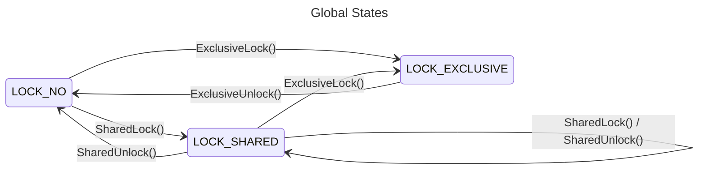
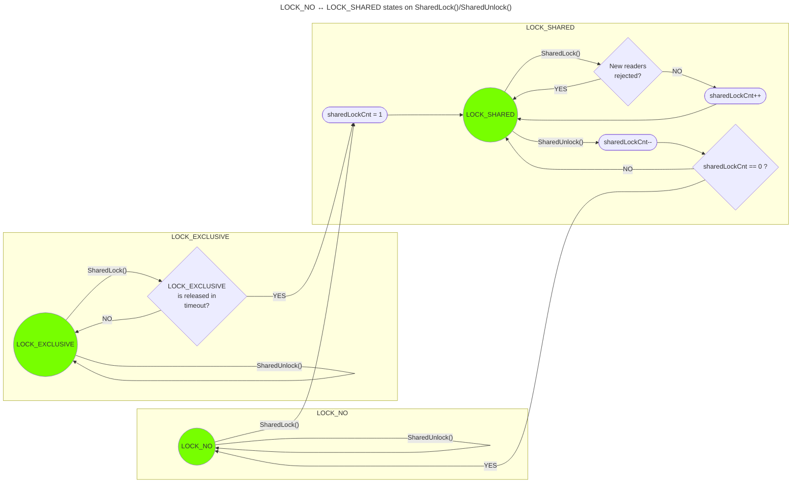
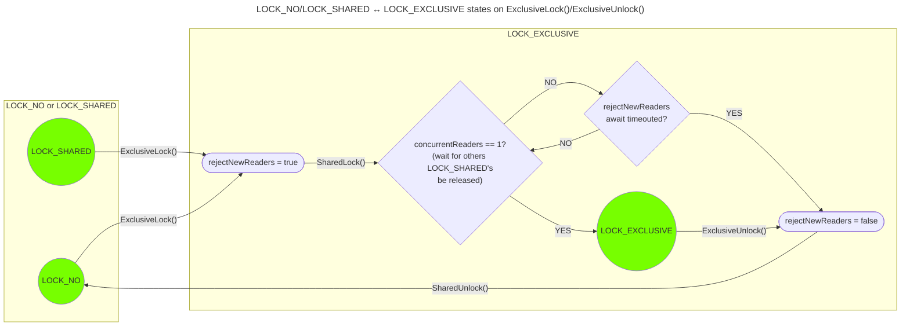

# RWLock (Shared Mutex)

## General

- LOCK_NO (unlocked): processes can write/read data to/from resource (data consistency warning)
- LOCK_SHARED (shared lock): multiple processes can read data from resource, but not write (same as mux.RLock() in golang)
- LOCK_EXCLUSIVE (exclusive lock): processes can do nothing with resource (full lock)

The most simplified scheme of the rw mutex relation is as follows:



---

## Synchronization Callbacks

- SharedMutex uses event-based synchronization via two callbacks: `WaitEvent` and `SignalEvent`
- These functions can be NULL — then locking is instant (success if free, busy if locked)

```c
SharedMutex_t mutex;

// No blocking — instant success or ERR_BUSY
SharedMutex_Init(&mutex, NULL, NULL, NULL);

// FreeRTOS example
SemaphoreHandle_t sem = xSemaphoreCreateBinary();
SharedMutex_Init(&mutex, sem, MyWaitEvent, MySignalEvent);

// Bare-metal example (custom polling implementation)
SharedMutex_Init(&mutex, &myFlag, MyBareWaitEvent, MyBareSignalEvent);
```

- When using with RTOS functions, you can not use locks inside critical sections. If a resource is locked and the WaitEvent function is running, the program will hang in an infinite loop
- If SharedMutex is used before the start of the OS scheduler and there are no errors in the user code, there will be no locks in a single-threaded environment and the WaitEvent() function will not be called at all

---

## Shared Lock

- Setting the LOCK_SHARED state prohibits actions that modify the resource
- The resource becomes read-only, and it can be read by several processes at the same time
- Each reader performs SharedLock() locking, retrieves the necessary data and returns possession of the resource by calling SharedUnlock()
- To control access of different processes, locks and unlocks within the resource are counted; a zero count means that all processes have released possession of the resource
- The LOCK_EXCLUSIVE state is a fully locking state and SharedLock() will wait for an event until the exclusive lock is released
- A state change request LOCK_SHARED -> LOCK_EXCLUSIVE blocks new read subscribers by setting the RejectNewReaders flag



---

## Exclusive Lock

- Setting the LOCK_EXCLUSIVE state is a complete locking of the resource, prohibiting any read and write operations
- When setting LOCK_EXCLUSIVE lock, the first action is to lock LOCK_SHARED, and then wait until the number of read subscribers drops to 1 - so, only the current lock remains; once this happens, the LOCK_EXCLUSIVE state is set



---

## External references

- [Golang Mutexes — What Is RWMutex For?](https://medium.com/bootdotdev/golang-mutexes-what-is-rwmutex-for-5360ab082626)
- [Mutexes and RWMutex in Golang](https://dev.to/cristicurteanu/mutexes-and-rwmutex-in-golang-4ij)
